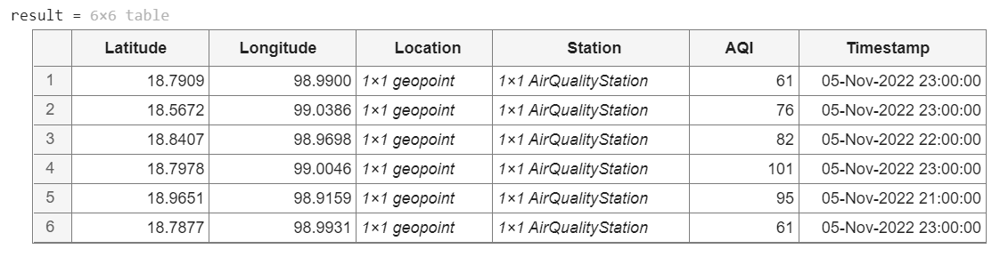
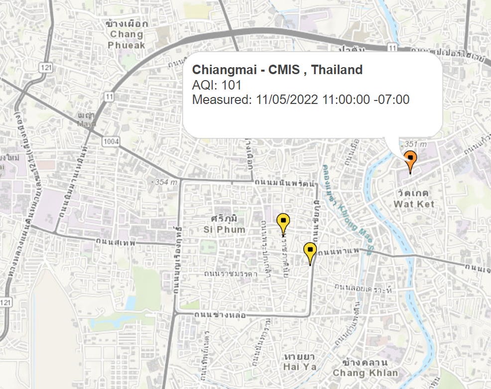

[](https://www.mathworks.com/matlabcentral/fileexchange/120043-waqi-matlab)

# WAQI client for MATLAB

WAQI (World Air Quality Index) provides open API for reading air quality data from the stations registered on the project.

## Get your API token

Request the WAQI API access token at https://aqicn.org/api/.

## Usage

### Get air quality data for given location

```MATLAB
token = "<your token>";
aqi = waqi.WAQI(token);

% Get data for the given known city
bangkok = aqi.city("bangkok");

% Get data from the nearest station for given coordinates
seattle = aqi.nearest([47.62050, -122.34930]);
```

### Get list of stations for given geographic area

```MATLAB
% Geographic boundary
chiang_mai_area = [
    geopoint(19.05580, 98.53775)
    geopoint(18.41727, 99.32121)
];

% Get list of stations
result = aqi.stations(chiang_mai_area)
```

Result includes locations of returned stations, station information and current readings of AQI:


Display stations on the map:

```MATLAB
station_names = [result.Station.Name];
station_descriptions = arrayfun(@(a, t) sprintf("AQI: %.0f<br/>Measured: %s", a, string(t, "M/dd/yyyy hh:mm:ss XXX")), result.AQI, result.Timestamp);

colors = cell2mat(arrayfun(@colorcode, result.AQI, UniformOutput=false));

wmmarker(result.Location, FeatureName=station_names, Description=station_descriptions, Color=colors);

% A helper function to color code values of AQI
function color = colorcode(aqi)
    if aqi <= 50
        % Good
        color = [0, 153/255, 102/255];
    elseif aqi <= 100
        % Moderate
        color = [1, 222/255, 51/255];
    elseif aqi <= 150
        % Unhealthy for Sensitive Groups
        color = [1, 153/255, 51/255];
    elseif aqi <= 200
        % Unhealthy
        color = [204/255, 0, 51/255];
    elseif aqi <= 300
        % Very Unhealthy
        color = [102/255, 0, 153/255];
    else
        % Hazardous
        color = [126/255, 0, 35/255];
    end
end
```


